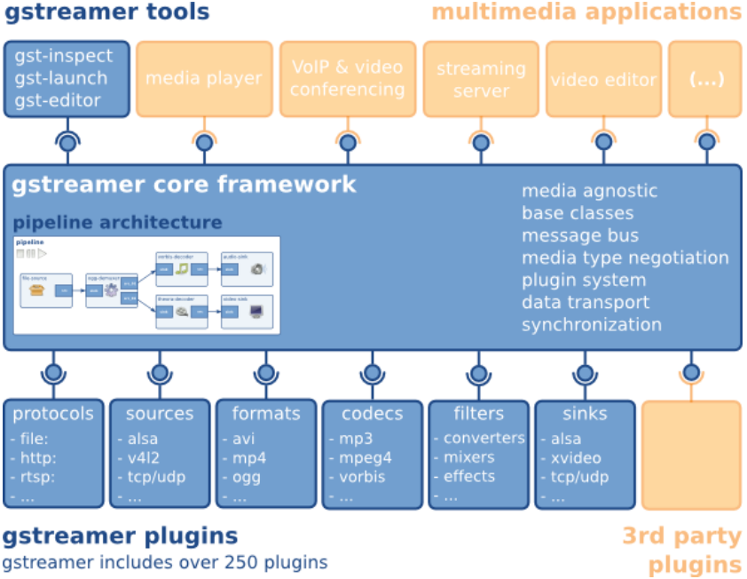

<!--
theme: default
class: lead
-->

## GStreamer & QTIQMMFSrc Element Overview

---

## GStreamer란?

 

### - Multimedia application을 위한 framework
### - Linux, Windows, OS X, Android 등 지원...
### - 20년 이상된 opensource project

---
 
## Feature

 

### - Plugin으로 확장 가능, 유연함
### - Often wraps other libraries (decoders, encoders, filters, etc.)
### - Pipeline-based
### - Bindings to multiple languages (C/C++, Python, Java, Ruby, Pearl, etc.)

---

{:.aligncenter}
