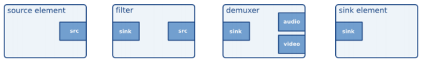

<!--
theme: default
class: lead
-->

## GStreamer & QTIQMMFSrc Element Overview

---

## GStreamer란?

 

### - Multimedia application을 위한 framework
### - Linux, Windows, OS X, Android 등 지원...
### - 20년 이상된 opensource project

---
 
## Feature

 

### - Plugin으로 확장 가능, 유연함
### - Often wraps other libraries (decoders, encoders, filters, etc.)
### - Pipeline-based
### - Bindings to multiple languages (C/C++, Python, Java, Ruby, Pearl, etc.)

---

## GStreamer Overall Architecture

 

---

## GStreamer Pipeline Example

 

---

## Element

### - GStreamer에서 가장 중요한 class object
### - Element들은 자신만의 명시된 기능을 지원
### - Element들은 서로 연결되고 data가 전달됨
### - GStreamer는 많은 elements들을 제공
### - Element 종류 : Source, sink, filter, converters, demuxers, muxers, codecs

 

---

## Pads

### - Element들 간의 연결지점(connection points)

### - Src(source) pads는 data를 생성.
### - Sink pads는 data를 소비 (수신함).
### - Data는 !항상! src pads에서 sink pads로 흐름.
### - pull or push mode로 동작.

---

## Pads (Cont)

### - Pad는 Capabilities or Caps라는 속성(property)을 가짐
### - Caps는 element들 간의 연결을 검증하는데 사용됨 (data의 type을 제한함)
### - Src pad와 sink pad는 각 pad들이 허용하는 data type이 호환되는 경우에 연결
- 예를 들어, video stream을 생성하는 src pad는 audio stream을 수신하는 sink pad와 연결될 수 없음
### - Elements는 사용할 형식에 대해 서로 협상할 수 있음 (caps negotiation)

---

## Pads (Cont)

 

---

## Bin

### - Element들은 bin이라는 컨테이너로 그룹화 될 수 있음

 

---

## Pipeline

### - A top-level bin
### - Communication을 위해 bus를 제공
### - 재생 동기화를 관리함.
### - 분리된 thread에서 실행됨.

 

